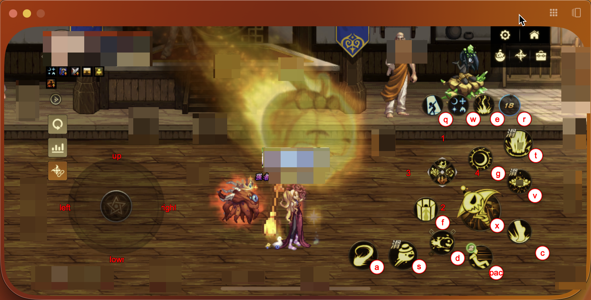

# gameX1

## 简介

本项目基于 Python 实现在 “iPhone镜像” 上进行键盘操控映射，目前仅支持【DNF手游-国服】



## 开发、测试平台

- python@3.9.6

- Mac M1 Pro Sequoia@15.0

## 安装依赖

```sh
pip install -r requirements.txt
```

## 运行

```sh
python main.py
```

## 提示

1. 按键配置文件在 `./keyMapConfigs.py` 可以自行配置

2. GUI 版本配置开发中

3. 由于 “iPhone镜像” 仅支持鼠标操控，无法多点触控，因此暂不支持 “移动施法技能”

## TODO

[] 优化悬浮提示展示，改为重叠在上面，但键盘按下的时候就自动隐藏，松开后恢复展示

[] 优化后跳、闪避左、右、移动技能

[] 悬浮点提示支持拖拽配置到本地，保存多份记录

[] 添加打包构建桌面应用
